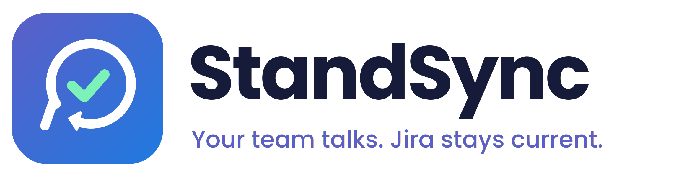
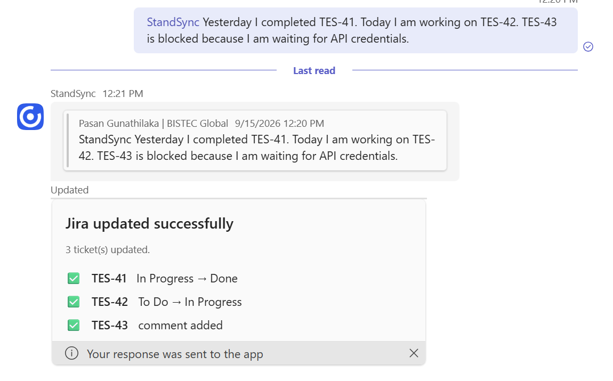

<p align="center">
  
</p>

<p align="center">
  <em>"Your team talks. Jira stays current."</em>
</p>

<p align="center">
  <strong>Claude-powered standup automation for Microsoft Teams and Jira.</strong><br/>
  Turn a normal standup message into reviewed Jira updates — without making developers enter the same information twice.
</p>

---

## StandSync V1

StandSync is a Microsoft Teams application that understands daily standup updates and turns them into proposed Jira actions.

A developer writes what they normally would:

> **@StandSync** Yesterday I completed TES-41. Today I am working on TES-42. TES-43 is blocked because I am waiting for API credentials.

StandSync then:

1. Detects the Jira tickets.
2. Reads their current state from Jira.
3. Uses Claude to understand what the developer actually meant.
4. Builds proposed status changes and comments.
5. Shows them as an Adaptive Card in Teams.
6. Waits for a human to approve.
7. Updates Jira only after approval.

<p align="center">
  
</p>

---

## The problem

Developers already describe their progress during standup.

Then they often have to open Jira and enter the same information again.

That creates duplicate work:

```text
Standup in Teams
      ↓
"I finished TES-41"
      ↓
Open Jira
      ↓
Find TES-41
      ↓
Move it to Done
```

When that second step gets skipped, Jira becomes stale.

StandSync removes the duplicate step.

```text
Teams standup
      ↓
   StandSync
      ↓
Claude understands intent
      ↓
StandSync checks live Jira state
      ↓
Proposed Jira changes
      ↓
Human approves
      ↓
Jira updated
```

---

## Why Claude?

A simple keyword rule can understand:

```text
"Completed AP-92"
```

But real standups are rarely that simple.

For example:

```text
"Mostly finished AP-92, but QA found another issue.
Don't close it yet."
```

A rule may see **finished** and move the ticket to Done.

StandSync understands that the developer explicitly said **not to close it**.

Another example:

```text
"Working on AP-92 but blocked waiting for credentials."
```

StandSync can understand both facts:

- the ticket is being worked on
- there is a blocker worth recording in Jira

Claude's job is only to interpret the meaning of the standup.

It does **not** update Jira.

---

## Safe by design

> **AI recommends → Human approves → StandSync executes.**

Claude never has direct write access to Jira.

The safety boundary is deliberately separated:

```text
Claude
  ↓
Intent only
  ↓
StandSync proposal engine
  ↓
Teams approval
  ↓
Human
  ↓
StandSync Jira executor
  ↓
Jira REST API
```

StandSync V1 includes:

- **Approve All**
- **Review individual proposals**
- **Apply Selected**
- **Reject**
- Low-confidence proposals start unselected
- Live Jira state validation
- Live Jira transition lookup
- No hard-coded transition IDs
- Atomic protection against double approval
- SQLite audit history
- Sanitised error handling

A second approval cannot accidentally apply the same Jira changes twice.

---

## What StandSync understands

Claude classifies each mentioned ticket into one of six intents:

| Intent | Meaning |
|---|---|
| `completed` | Work is complete |
| `in_progress` | Work has started / is continuing |
| `blocked` | Work is blocked |
| `not_done_yet` | Work is not ready to close |
| `no_change` | No Jira action is required |
| `unclear` | StandSync is not confident enough to infer the intent |

Each interpretation also includes:

- confidence
- evidence from the original standup
- blocker reason where applicable
- suggested comment where useful

StandSync then combines that intent with the ticket's **actual current Jira state** before proposing an action.

---

## Multi-project support

StandSync V1 is not tied to the demo `TES` project.

The runtime is project-agnostic.

A single standup can contain:

```text
TES-41
AP-92
BCPM-33
```

StandSync reads each ticket directly from Jira and resolves its available transitions independently.

The only requirements are:

- the configured Jira account can access the ticket
- the project's workflow statuses are known to StandSync

Projects with different terminology can use per-project overrides:

```env
JIRA_STATUS_OVERRIDES={"BCPM":{"done":"Closed","inProgress":"Doing"}}
```

`JIRA_PROJECT_KEY` is used only by the demo ticket seeding script.

---

## V1 features

StandSync V1 currently includes:

- Microsoft Teams bot/application
- `@StandSync` standup invocation
- Teams Adaptive Cards
- Jira ticket detection
- Multiple Jira projects in one standup
- Live Jira issue-state lookup
- Live Jira transition lookup
- Claude-powered intent interpretation
- Confidence and evidence
- Proposed Jira transitions
- Proposed Jira comments
- Approve All
- Review and Apply Selected
- Reject
- Human approval before every Jira write
- Jira Cloud REST API v3 integration
- SQLite audit trail
- Double-approval protection
- Per-project workflow overrides
- Mock LLM provider for offline testing
- Claude Code provider
- Optional Anthropic provider
- Teams-free development endpoints
- Real Teams → Claude → Jira end-to-end verification

---

## Architecture

```text
                    ┌───────────────────┐
                    │  Microsoft Teams  │
                    └─────────┬─────────┘
                              │
                        Standup message
                              │
                              ▼
                    ┌───────────────────┐
                    │     StandSync     │
                    │      Fastify      │
                    └─────────┬─────────┘
                              │
                    Detect Jira tickets
                              │
                 ┌────────────┴────────────┐
                 ▼                         ▼
        ┌─────────────────┐       ┌─────────────────┐
        │      Jira       │       │     Claude      │
        │ status + live   │       │ interpret only  │
        │   transitions   │       │                 │
        └────────┬────────┘       └────────┬────────┘
                 └────────────┬────────────┘
                              ▼
                    ┌───────────────────┐
                    │ Proposal engine   │
                    └─────────┬─────────┘
                              ▼
                    ┌───────────────────┐
                    │ Teams Adaptive    │
                    │       Card        │
                    └─────────┬─────────┘
                              │
                        Human approval
                              │
                              ▼
                    ┌───────────────────┐
                    │ Jira REST API     │
                    │ transition/comment│
                    └───────────────────┘
```

### Main components

- **Microsoft Teams SDK** — receives standups and handles Adaptive Card actions
- **Fastify** — HTTP server
- **StandSync pipeline** — ticket detection, interpretation and proposal generation
- **LLMClient** — provider-independent Claude interface
- **Jira client** — Jira Cloud REST API v3
- **SQLite** — batches, proposals, approvals and results
- **Approval executor** — the only path allowed to perform Jira writes

---

## Quick start

### Requirements

- Node.js 20+
- Microsoft Teams bot/application credentials
- Jira Cloud account with API access
- Claude Code login or Anthropic API credentials

### Install

```bash
npm install
```

Create your local environment file:

```bash
cp .env.example .env
```

Fill in the required values in `.env`.

Never commit `.env` or real credentials.

### Verify the project

```bash
npm run typecheck
npm run lint
npm test
```

### Start StandSync

```bash
npm run dev
```

Verify:

```text
GET /health
```

A healthy StandSync instance returns HTTP `200`.

---

## Teams usage

In the configured Teams conversation, mention StandSync and write a normal standup:

```text
@StandSync Yesterday I completed TES-41.
Today I am working on TES-42.
TES-43 is blocked because I am waiting for API credentials.
```

StandSync checks Jira and replies with proposed actions.

Example:

```text
TES-41
In Progress → Done

TES-42
To Do → In Progress

TES-43
Add blocker comment

[Approve All] [Review] [Reject]
```

Nothing is written to Jira yet.

After approval:

```text
✅ TES-41   In Progress → Done
✅ TES-42   To Do → In Progress
✅ TES-43   comment added
```

---

## Demo

The verified V1 demo uses three tickets:

| Ticket | Starting state | Standup intent | Result |
|---|---|---|---|
| TES-41 | In Progress | Completed | Done |
| TES-42 | To Do | Working on | In Progress |
| TES-43 | In Progress | Blocked | Blocker comment |

Example standup:

```text
@StandSync Yesterday I completed TES-41.
Today I am working on TES-42.
TES-43 is blocked because I am waiting for API credentials.
```

The full Teams → Claude → approval → Jira flow has been verified against:

- real Microsoft Teams
- real Claude
- real Jira Cloud

---

## Testing

Current V1 status:

```text
202 tests passing
TypeScript typecheck: clean
ESLint: clean
```

The default test suite makes no network calls.

Tests cover areas including:

- ticket extraction
- Claude interpretation
- malformed model output
- timeouts and provider failures
- proposal generation
- Jira transition resolution
- multi-project standups
- project-specific workflow statuses
- Adaptive Card payloads
- approval/rejection
- duplicate approval protection
- Jira client failures and retries
- audit persistence
- safety boundaries

Live integration tests are kept separate from the default offline suite.

---

## Scripts

| Script | Purpose |
|---|---|
| `npm run dev` | Start StandSync with hot reload |
| `npm run typecheck` | Run strict TypeScript validation |
| `npm run lint` | Run ESLint |
| `npm test` | Run the offline Vitest suite |
| `npm run seed:jira` | Create/reset demo Jira tickets |
| `npm run dev:post` | Send a standup through the development endpoint |
| Teams package script | Build the Microsoft Teams installation package |

---

## V1 boundaries

StandSync V1 intentionally keeps the scope small.

Current limitations:

- Teams messages require an `@StandSync` mention
- One Teams conversation is configured at a time
- Jira writes use a shared service account
- Some Jira projects may require workflow-status overrides
- Competition deployment currently runs locally behind a Microsoft dev tunnel
- SQLite is local to the StandSync instance
- StandSync is not yet deployed as a production cloud service

These are V1 deployment/configuration boundaries, not changes to the core workflow.

---

## Roadmap

Post-V1 possibilities include:

- **Automatic standup monitoring** using Teams Resource-Specific Consent
- **Stale Jira ticket detection**
- **Production cloud hosting**
- **Managed persistent database**
- **Multiple Teams/team configuration**
- **Workflow auto-discovery**
- **Blocker and adoption reporting**
- **Per-user Jira attribution**

---

## Design principle

StandSync deliberately separates **understanding** from **acting**.

Claude can say:

> “I believe TES-41 was completed.”

But Claude cannot transition TES-41.

Only StandSync's deterministic application code can determine the Jira action, and only after a human approves it.

That distinction is the foundation of StandSync V1.

---

<p align="center">
  <strong>StandSync V1</strong><br/>
  <em>Your team talks. Jira stays current.</em>
</p>